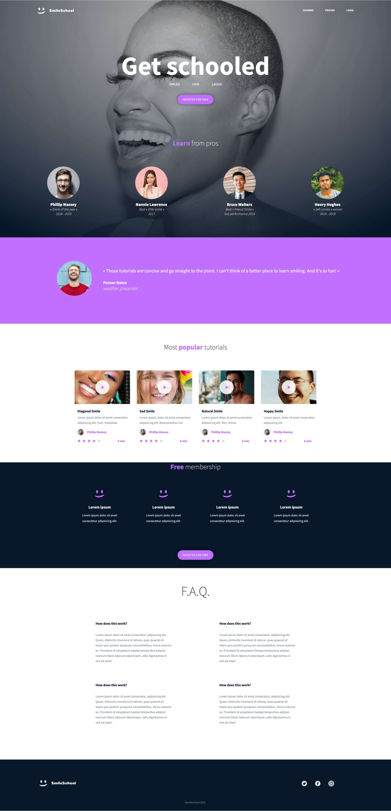

# Frontend Mentor - Testimonials grid section solution

This is a solution to the [The advanced CSS challenge by ALX-africa](https://savanna.alxafrica.com/projects/101192). As part of the requirement to the Front-End Web Development bootcamp Cohort 5.

## Table of contents

- [Overview](#overview)
  - [The challenge](#the-challenge)
  - [Screenshot](#screenshot)
  - [Links](#links)
- [My process](#my-process)
  - [Built with](#built-with)
  - [What I learned](#what-i-learned)
  - [Continued development](#continued-development)
  - [Useful resources](#useful-resources)
- [Author](#author)
- [Acknowledgments](#acknowledgments)

## Overview

### The challenge

Requires that i build a landing page for smileschool.

### Screenshot

<figure>
  <figcaption>desktop view: </figcaptioni> 
  
</figure>

## My process

### Built with

- Semantic HTML5 markup
- CSS custom properties
- I spent 34 hours building this project from markup to styling

### What I learned

- Confidence boast to start and finish a project with no assistance
- Understood working with figma designs

### Continued development

Improvement on ETA when building

## Author

- Frontend Mentor - [@nuelose](https://www.frontendmentor.io/profile/nuelose)
- Twitter - [@isnuelo](https://www.twitter.com/isnuelo)

## Acknowledgments

Thank you to my fellow learner, community member, technical and non-technical mentors @ alx-africa. Awesome job guys
